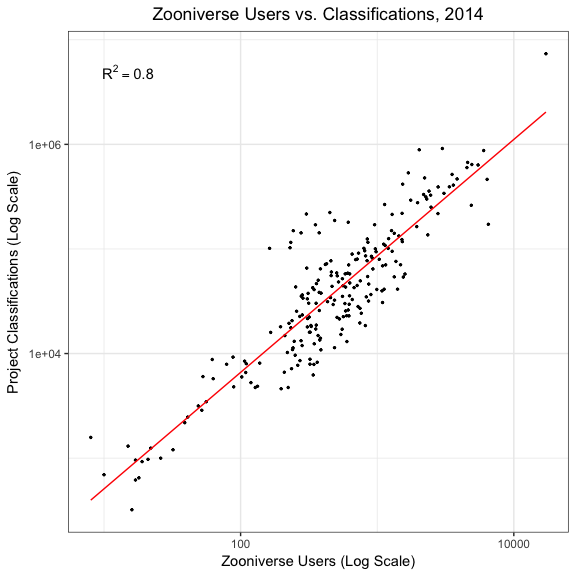
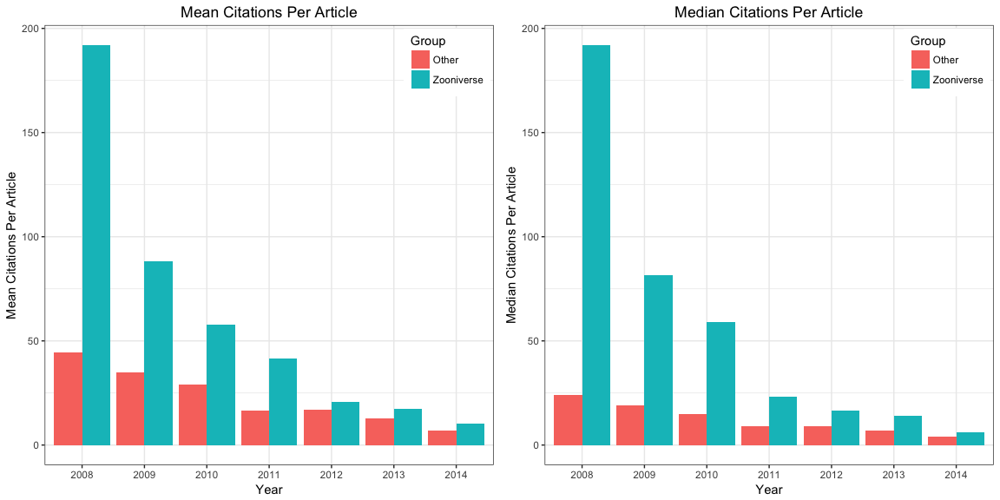
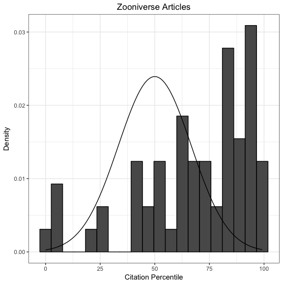
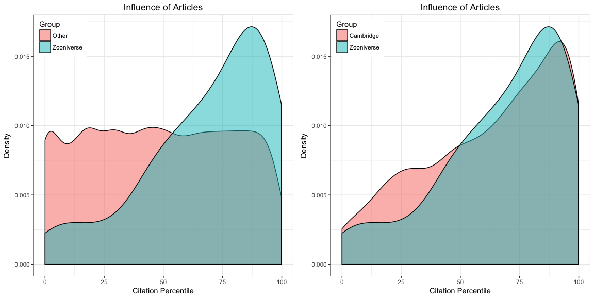
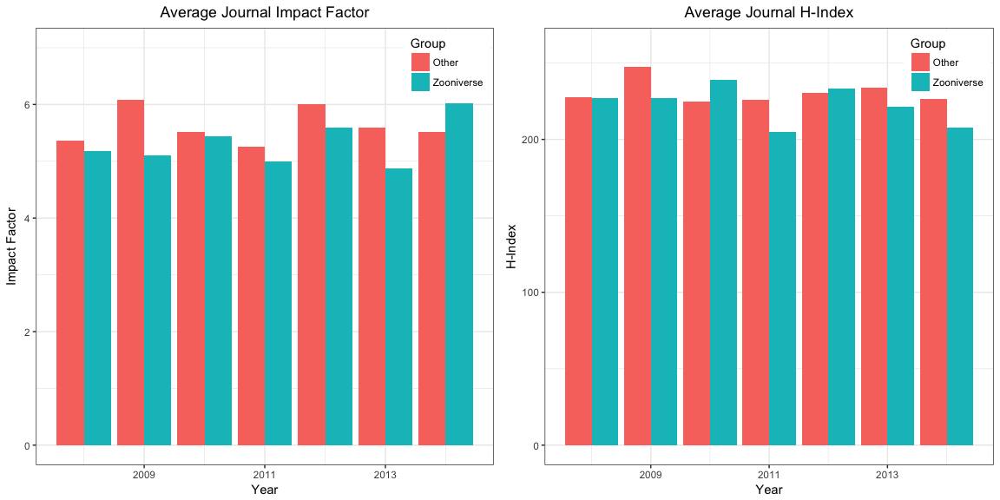

Crowdsourced Science
================

This script reproduces the results and figures from a paper I recently co-authored with Prof. Luciano Floridi on the philosophical implications of crowdsourcing in the natural sciences ([Watson & Floridi, 2016](http://link.springer.com/article/10.1007/s11229-016-1238-2?wt_mc=Internal.Event.1.SEM.ArticleAuthorOnlineFirst)). The data were originally collected and analysed as part of my MSc research at the [Oxford Internet Institute](https://www.oii.ox.ac.uk/) back in 2015. My sources included [Zooniverse](https://www.zooniverse.org/), [Elsevier's Scopus database](https://www.elsevier.com/solutions/scopus), and the [Thomson Reuters Institute for Scientific Information Journal Citation Reports](http://thomsonreuters.com/en/products-services/scholarly-scientific-research/research-management-and-evaluation/journal-citation-reports.html), in addition to various articles and book chapters. See our paper for more details.

The plots below are all rendered using `ggplot2`, which is how I should have done them in the first place. I was unfamiliar with the phenomenal work of [Hadley Wickham](http://hadley.nz/) when I originally analysed these data. Never again!

This repository's Data.zip file contains clean CSVs of all data used for our study. Analysis was conducted in the [R statistical environment](https://www.r-project.org/) (version 3.2.2) using a MacBook Pro with 8GB of RAM.

``` r
# Load libraries
library(effsize)
library(gridExtra)
library(tidyverse)
```

Figure 1
========

This image was built by loading the data from Fig1.Dendro.csv into [RAW](http://raw.densitydesign.org/), a web application by Density Design Lab. I selected the Cluster Dendrogram option and did some minimal editing in [Adobe Photoshop](http://www.adobe.com/uk/products/photoshop.html) to remove a redundant root node.

Figure 3
========

This code recreates the log-log scatterplot and OLS regression of Zooniverse Users vs. Classifications.

``` r
# Import data
fig3 <- read_csv('./Data/Fig3.Scatter.csv')

# Calculate variance explained
(r2 <- cor(log(fig3$Classifications), log(fig3$Users))^2)
```

    ## [1] 0.8016764

``` r
lbl <- paste('R^2 == ', round(r2, 2))

# Build plot
ggplot(fig3, aes(Users, Classifications)) + 
  scale_x_log10() + scale_y_log10() + 
  geom_point(size = 0.5) + 
  geom_smooth(method = 'lm', se = FALSE, color = 'red', size = 0.5) + 
  annotate('text', x = 15, y = 5 * 1e06, label = lbl, parse = TRUE) + 
  labs(title = 'Zooniverse Users vs. Classifications, 2014',
       x = 'Zooniverse Users (Log Scale)',
       y = 'Project Classifications (Log Scale)') +
  theme_bw() + 
  theme(plot.title = element_text(hjust = .5))
```

<p align='center'>

</p>

Table 1
=======

This table and the accompanying test statistics were generated using the following code.

``` r
# Import data
tbl1 <- read_csv('./Data/Table1.Catalogues.csv')

# Create Percent_Increase column
p_i <- function(i) {
  diff <- tbl1$Observations[i] - tbl1$Observations[(i - 1)]
  p_i <- round(diff * 100 / tbl1$Observations[(i - 1)], 2)
  return(p_i)
}
tbl1 <- tbl1 %>% 
  mutate(Percent_Increase = c(NA, map_dbl(2:nrow(tbl1), p_i)))
tbl1$Percent_Increase[c(3, 6, 10, 14)] <- NA

# Print
tbl1 %>% select(Catalogue:Observations, Percent_Increase, Source)
```

| Catalogue                      | Method        |  Observations|  Percent\_Increase| Source                       |
|:-------------------------------|:--------------|-------------:|------------------:|:-----------------------------|
| Overlapping Galaxies           | Traditional   |            25|                 NA| Keel et al., 2013 (appendix) |
| Overlapping Galaxies           | Crowdsourcing |          1990|            7860.00| Keel et al., 2013            |
| Infrared Bubbles               | Traditional   |           322|                 NA| Churchwell et al., 2006      |
| Infrared Bubbles               | Traditional   |           591|              83.54| Churchwell et al., 2007      |
| Infrared Bubbles               | Crowdsourcing |          5106|             763.96| Simpson et al., 2012         |
| Galactic Morphologies          | Traditional   |         15729|                 NA| Schawinski et al., 2007      |
| Galactic Morphologies          | Traditional   |         19649|              24.92| Schawinski et al., 2007      |
| Galactic Morphologies          | Traditional   |         48023|             144.40| Schawinski et al., 2007      |
| Galactic Morphologies          | Crowdsourcing |        738175|            1437.13| Lintott et al., 2011         |
| Detailed Galactic Morphologies | Traditional   |          2253|                 NA| Fukugita et al., 2007        |
| Detailed Galactic Morphologies | Traditional   |          4458|              97.87| Baillard et al., 2011        |
| Detailed Galactic Morphologies | Traditional   |         14034|             214.80| Nair & Abraham, 2010         |
| Detailed Galactic Morphologies | Crowdsourcing |        304122|            2067.04| Willett et al., 2013         |
| Stellar Clusters               | Traditional   |           751|                 NA| Bastian et al., 2012         |
| Stellar Clusters               | Traditional   |           803|               6.92| San Roman et al., 2010       |
| Stellar Clusters               | Traditional   |           920|              14.57| Popescu et al., 2012         |
| Stellar Clusters               | Crowdsourcing |          2753|             199.24| Johnson et al., 2015         |

``` r
# Create separate vectors for testing
case <- tbl1 %>%
  filter(Method == 'Crowdsourcing') 
ctrl <- tbl1 %>%
  filter(Method == 'Traditional') %>%
  na.omit() 

# KS test
ks.test(case$Percent_Increase, ctrl$Percent_Increase)
```

    ## 
    ##  Two-sample Kolmogorov-Smirnov test
    ## 
    ## data:  case$Percent_Increase and ctrl$Percent_Increase
    ## D = 0.85714, p-value = 0.01515
    ## alternative hypothesis: two-sided

``` r
# Cohen's d
cohen.d(case$Percent_Increase, ctrl$Percent_Increase)
```

    ## 
    ## Cohen's d
    ## 
    ## d estimate: 1.215626 (large)
    ## 95 percent confidence interval:
    ##        inf        sup 
    ## -0.3600529  2.7913056

Figure 4
========

There is almost certainly some fast and easy way to calculate the percentile of every number in a distribution using the `quantile()` or `ecdf()` function. After wasting more than three minutes trying to figure it out, I decided to cut my losses and write the following custom function instead.

``` r
# Percentile function
perc <- function(x) {
    pos <- rank(x, ties.method = 'min')
    percentile <- ((pos - 1) / length(x)) * 100
    return(percentile)
}
```

This code concatenates the separate CSV files for each year/data source, and adds a citation percentile column.

``` r
# Control data by year and source
src <- c('CANDELS_2014', 'COSMOS_2014', 'GALEX_2014', 'HST_2012', 'Kepler_2012', 
         'Kepler_2013', 'Kepler_2014', 'NewHorizons_2013', 'PTF_2011', 'PTF_2013', 
         'SDSS_2008', 'SDSS_2009', 'SDSS_2010', 'SDSS_2011', 'SDSS_2012', 'SDSS_2013',
         'SDSS_2014', 'SpitzerGLIMPSE_2012', 'SpitzerGLIMPSE_2014', 'STEREO_2012')
files <- paste0('./Data/CtrlArticles/', src, '.csv')
concat <- function(i) {
  read_csv(files[i]) %>%
  select(-Link) %>%
  mutate(Source = src[i],
         Year = strsplit(src, split = '_')[[i]][2],
         Percentile = perc(Cited.by),
         Group = 'Other') %>%
  return()
}
ctrl <- map_df(seq_along(src), concat)

# Zooniverse data for comparison
case <- read_csv('./Data/ZooniverseArticles.csv') %>%
  mutate(Year = as.character(Year),
         Affiliations = NA,
         Percentile = NA,
         Group = 'Zooniverse') %>%
  select(Publication, Cited.by, Affiliations, Source, Year, Percentile, Group)
```

We now recreate Figure 4, which plots the mean and median citations per year for both Zooniverse and Other researchers.

``` r
# Combine case and ctrl
mix <- rbind(case, ctrl)

# Mean citations per article
p1 <- mix %>%
  group_by(Year, Group) %>%
  summarise_at('Cited.by', mean) %>%
  rename(Mean = Cited.by) %>%
  ggplot(aes(Year, Mean, fill = Group)) + 
  geom_bar(stat = 'identity', position = 'dodge') + 
  labs(title = 'Mean Citations Per Article',
       x = 'Year',
       y = 'Mean Citations Per Article') + 
  theme_bw() + 
  theme(plot.title = element_text(hjust = .5),
        legend.justification = c(0.99, 0.99),
        legend.position = c(0.99, 0.99))

# Median citations per article
p2 <- mix %>%
  group_by(Year, Group) %>%
  summarise_at('Cited.by', median) %>%
  rename(Median = Cited.by) %>%
  ggplot(aes(Year, Median, fill = Group)) + 
  geom_bar(stat = 'identity', position = 'dodge') + 
  labs(title = 'Median Citations Per Article',
       x = 'Year',
       y = 'Median Citations Per Article') + 
  theme_bw() + 
  theme(plot.title = element_text(hjust = .5),
        legend.justification = c(0.99, 0.99),
        legend.position = c(0.99, 0.99))

# Print
grid.arrange(p1, p2, ncol = 2)
```

<p align='center'>

</p>

Figure 5
========

To calculate citation percentiles for Zooniverse articles, I compared the numbers for each against those by others publishing in the same year using the same data. I then plot this distribution as a histogram with a normal curve *N*(50, 16.67<sup>2</sup>) overlaid for comparison. These parameters are chosen to mimic the theoretical expectation of a perfectly average lab, where the majority of articles are at or near the middle of the citation percentile range and all points under the curve on \[0, 100) fall within three standard deviations of the mean.

``` r
# Calculate Zooniverse citation percentiles
zp <- function(i) {
  ctrl %>%
    filter(Source == case$Source[i]) %>%
    rbind(case[i, ]) %>%
    mutate(Percentile = perc(Cited.by)) %>%
    filter(Group == 'Zooniverse') %>%
    select(Percentile) %>%
    as.numeric() %>%
    return()
}
case <- case %>%
  mutate(Percentile = map_dbl(1:nrow(case), zp))

# Plot results
ggplot(case, aes(Percentile)) + 
  geom_histogram(bins = 20, color = 'black', aes(y = ..density..)) + 
  stat_function(fun = dnorm, args = list(mean = 50, sd = 16.67)) + 
  labs(title = 'Zooniverse Articles',
       x = 'Citation Percentile',
       y = 'Density') + 
  theme_bw() + 
  theme(plot.title = element_text(hjust = .5))
```

<p align='center'>

</p>

``` r
# KS test
ks.test(case$Percentile, 'pnorm', mean = 50, sd = 16.67)
```

    ## 
    ##  One-sample Kolmogorov-Smirnov test
    ## 
    ## data:  case$Percentile
    ## D = 0.46399, p-value = 5.095e-12
    ## alternative hypothesis: two-sided

Figure 6
========

This code recreates the density plots comparing the citation percentiles of Zooniverse articles vs. those by all other researchers, and vs. those by Cambridge astronomers, respectively.

``` r
# Zooniverse vs. Others
mix <- rbind(case, ctrl)

p1 <- ggplot(mix, aes(Percentile, group = Group, fill = Group)) +
  geom_density(alpha = 0.5) + 
  labs(title = 'Influence of Articles',
       x = 'Citation Percentile',
       y = 'Density') +
    theme_bw() +
    theme(plot.title = element_text(hjust = .5),
          legend.justification = c(0.01, 0.99),
          legend.position = c(0.01, 0.99)) 

# Zooniverse vs. Cambridge
camb <- mix %>%
  filter(grepl('Cambridge', Affiliations)) %>%
  mutate(Group = 'Cambridge')

p2 <- camb %>%
  rbind(case) %>%
  ggplot(aes(Percentile, group = Group, fill = Group)) + 
  geom_density(alpha = 0.5) + 
  labs(title = 'Influence of Articles',
       x = 'Citation Percentile',
       y = 'Density') +
    theme_bw() +
    theme(plot.title = element_text(hjust = .5),
          legend.justification = c(0.01, 0.99),
          legend.position = c(0.01, 0.99)) 

# Print
grid.arrange(p1, p2, ncol = 2)
```

<p align='center'>

</p>

``` r
# KS tests
ks.test(case$Percentile, ctrl$Percentile)
```

    ## 
    ##  Two-sample Kolmogorov-Smirnov test
    ## 
    ## data:  case$Percentile and ctrl$Percentile
    ## D = 0.33264, p-value = 2.561e-06
    ## alternative hypothesis: two-sided

``` r
ks.test(case$Percentile, camb$Percentile)
```

    ## 
    ##  Two-sample Kolmogorov-Smirnov test
    ## 
    ## data:  case$Percentile and camb$Percentile
    ## D = 0.11878, p-value = 0.3935
    ## alternative hypothesis: two-sided

Figure 7
========

This code recreates the bar plots and statistical tests comparing average journal impact factor and h-index for articles published by Zooniverse vs. those by others using the same data.

``` r
# Load data
fig7 <- read_csv('./Data/Fig7.JournalData.csv')

# Impact factor 
p1 <- ggplot(fig7, aes(Year, IF, fill = Group)) + 
  geom_bar(stat = 'identity', position = 'dodge') + 
  ylim(0, 7) + 
  labs(title = 'Average Journal Impact Factor',
       x = 'Year',
       y = 'Impact Factor') + 
  theme_bw() + 
  theme(plot.title = element_text(hjust = .5),
        legend.justification = c(0.99, 0.99),
        legend.position = c(0.99, 0.99))

# H-Index
p2 <- ggplot(fig7, aes(Year, H, fill = Group)) + 
  geom_bar(stat = 'identity', position = 'dodge') + 
  ylim(0, 260) + 
  labs(title = 'Average Journal H-Index',
       x = 'Year',
       y = 'H-Index') + 
  theme_bw() + 
  theme(plot.title = element_text(hjust = .5),
        legend.justification = c(0.99, 0.99),
        legend.position = c(0.99, 0.99))

# Print
grid.arrange(p1, p2, ncol = 2)
```

<p align='center'>

</p>

``` r
# KS tests
ks.test(fig7$IF[fig7$Group == 'Zooniverse'], fig7$IF[fig7$Group == 'Other'])
```

    ## 
    ##  Two-sample Kolmogorov-Smirnov test
    ## 
    ## data:  fig7$IF[fig7$Group == "Zooniverse"] and fig7$IF[fig7$Group == "Other"]
    ## D = 0.57143, p-value = 0.2121
    ## alternative hypothesis: two-sided

``` r
ks.test(fig7$H[fig7$Group == 'Zooniverse'], fig7$H[fig7$Group == 'Other'])
```

    ## 
    ##  Two-sample Kolmogorov-Smirnov test
    ## 
    ## data:  fig7$H[fig7$Group == "Zooniverse"] and fig7$H[fig7$Group == "Other"]
    ## D = 0.42857, p-value = 0.5412
    ## alternative hypothesis: two-sided
